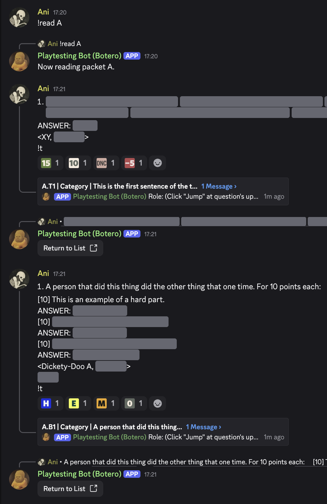

# Playtesting Bot

This is a Discord bot that can be used to playtest ACF-style quizbowl questions. After the bot is invited to a server and configured, it can be used for either or both of two situations:

* Internal "**asynchronous**" playtesting (*question-by-question*)
  * As questions are written and edited, they may be playtested internally by other members of the editing team. This occurs *asynchronously*, with each member playing the question individually.
  * In this workflow, editors play questions via DMs with the bot. Each question may be discussed in an associated thread.
  * The conversion statistics are published to a new thread in a "results" channel (e.g. `#results`).
* External "**bulk**" playtesting (*packet-by-packet* or *category-by-category*)
  * Once a set reaches the stage at which packets are being assembled, packets or categories may be playtested as a whole with a troupe of playtesters who are not on the editing team. This occurs in "*bulk*," with the troupe at once hearing all of the questions in a given packet being read over audio.
  * In this workflow, playtesters give answers in a bulk playtesting channel. Playtesters use reactions to indicate their results for each question (e.g. `10`/`-5` for tossups; `E`/`M`/`H`/`0` for bonuses). Each question may be discussed in an associated thread.
  * The conversion statistics and links to each question thread are published to a new thread in an index channel (e.g. `#questions`).

The bot was created by [Jordan Brownstein](https://github.com/JemCasey) in 2023 for the production of 2024 Chicago Open. Jordan wrote the bulk of the code, and in 2024 [Ani Perumalla](https://github.com/ani-per) added a few new features for the production of 2025 ACF Regionals. [Ophir Lifshitz](https://github.com/hftf) designed the bulk playtesting react emojis and provided suggestions and feedback on features.

---

## Instructions for Users

These instructions for users have been split based on whether you are a manager for the bot or whether you are just an editor or playtester in the production server.

> [!IMPORTANT]
> Bot managers must configure the bot before it may be used by editors and playtesters.

---

### Instructions for Bot Managers

A list of available instances of the Playtesting Bot, as of September 2025:

* [Botero](https://en.wikipedia.org/wiki/Fernando_Botero)
  * The official ACF Playtesting Bot, created by [Ani Perumalla](https://github.com/ani-per/playtesting-bot) and run by the [ACF Webmaster](https://acf-quizbowl.com/members/#officers).
  * Use [this invite link](https://discord.com/api/oauth2/authorize?client_id=1311780100123131914&permissions=67584&scope=bot) to add Botero to your server.
* [Botticelli](https://en.wikipedia.org/wiki/Sandro_Botticelli)
  * [Jordan Brownstein's original instance of the Playtesting Bot.](https://github.com/JemCasey/playtesting-bot) It is reliable, but lacks some of the newer features (e.g. bulk playtesting, category roles).
  * Use [this invite link](https://discord.com/api/oauth2/authorize?client_id=1128432579436101724&permissions=67584&scope=bot) to add Botticelli to your server.

> [!NOTE]
> If you want to host your own instance of the bot instead of relying on an existing instance, you can follow the steps under [Instruction for Developers](#instructions-for-developers) to set up your own instance.

#### Configuration

> [!TIP]
> It is strongly recommended that you use the [ACF Production Server Template](https://discord.new/ps5S8Bsxwfra) [^1] for your production/playtesting server. The bot has been extensively tested in that framework, and using it will save you the significant amount of time necessary to set up all the necessary roles, permissions, and channels.

Once added to the server, follow the instructions below to configure the bot:

* Give the bot any roles it needs to access the playtesting channels. If you use the ACF Production Server Template, just give it the `Bot` role.
* To prepare for asynchronous playtesting:
  * Create channel(s) where the bot can access questions for async playtesting (e.g. `#literature`, `#arts`).
  * Create channel(s) where the bot can produce the results of playtesting (e.g. `#results`).
* To prepare for bulk playtesting:
  * Create channel(s) where the bot can access questions for bulk playtesting (e.g. `#playtesting`).
  * Create a channel where the bot can "echo" question metadata (e.g. `#questions`). This channel will serve as an index for anyone to easily find each question's discussion thread.
* The above steps are already completed if you use the ACF Production Server Template.
* Send `!config` in a channel to which the bot has access (e.g. `#bots`). **You must follow all necessary steps,** as per [this example image](./examples/config.png).

> [!IMPORTANT]
> If you would like sensitive data, such as question answers and playtester notes, to be encrypted in the bot's database, add a role to your server called `secret` before playtesting any questions. **Once created, this role should not be deleted.** Some planned commands that access answer data will not be able to decrypt it if the role is removed or recreated.

---

### Instructions for Editors

#### Formatting

To set up a question for playtesting through the bot, add spoiler marks as per the examples below for [tossups](#tossup-formatting) and [bonuses](#bonus-formatting) and paste the content in the desired channel.

> [!TIP]
> Add `!t` somewhere in the question message if you want the bot to auto-create a discussion thread (this is recommended). If triggered via this command, the bot will automatically parse the category and add users with the corresponding role to the thread.

> [!TIP]
> It is strongly recommended that users of Google Docs use the [Paster Dingus](https://minkowski.space/quizbowl/paster/). This tool converts the content of a Google Docs question to the spoiler-tagged Discord Markdown version expected by the bot. Copy the question from Google Docs and paste into the tool's left panel; the formatted version will appear on the right panel. Tick the checkbox to add spoiler marks and the auto-thread command.

> [!NOTE]
> Messages should only contain one question; if you're playtesting a batch of questions, send them one by one.

##### Tossup Formatting

<code>\*\*||This thinker claimed to see “another universe” upon reading an essay prompt asking whether culture leads to “the purification of morals.”|| ||This thinker’s story of hunters who defect to pursue a hare inspired Brian Skyrms’s “stag hunt” game.|| ||This thinker accused David Hume of plotting against him while Hume sheltered him during the fallout over one of his books,|| ||which notes that those who “refuse” to join the “whole body” will be “forced to be free.”|| ||This thinker defined (\*)||\*\* ||\_amour-propre\_ and \_amour de soi\_|| ||in a book that traces civil society to the first man who “enclosed a piece of ground” and declared, “This is mine.”|| ||This thinker theorized the “general will”|| ||in a book that claims man is “everywhere… in chains.”|| ||For 10 points, name this author of \_Discourse on Inequality\_ and \_The Social Contract\_.||
ANSWER: ||Jean-Jacques \_\_\*\*Rousseau\*\*\_\_||
\<JB\, Philosophy\>
!t</code>

##### Bonus Formatting

<code>This author’s daughter Susan protested declining biodiversity in essays like “Lament for the Birds” and her “nature diary” \_Rural Hours\_. For 10 points each:
[10] Name this author of a novel whose protagonist decries the “wasty ways” of the townsfolk of Templeton, who massacre thousands of passenger pigeons and leave piles of fish rotting on the shores of Lake Otsego.
ANSWER: ||James Fenimore \_\_\*\*Cooper\*\*\_\_||
[10] ||Cooper presented his early preservationist views via the character of Natty Bumppo in works like \_The Pioneers\_ and this novel. Chingachgook, who is the title character of this novel, escorts Colonel Munro’s daughters.||
ANSWER: ||\_The \_\_\*\*Last of the Mohicans\*\*\_\_\_||
[10] ||In \_The Pioneers\_, Natty is arrested for performing this action after Templeton adopts anti-waste laws. Natty’s rifle is nicknamed for this action, which titles the chronologically first Leatherstocking Tale.||
ANSWER: ||\_\_\*\*kill\*\*\_\_ing a \_\_\*\*deer\*\*\_\_ [accept any synonyms in place of “killing,” such as \_\_\*\*hunt\*\*\_\_ing or \_\_\*\*shoot\*\*\_\_ing; accept \_\_\*\*Killdeer\*\*\_\_ or \_The \_\_\*\*Deerslay\*\*\_\_er\_; prompt on partial answers]||
\<JB\, American Literature\>
||h/e/m||
!t</code>

> [!TIP]
> The formatting style seen above is the default output style used by the [Paster Dingus](https://minkowski.space/quizbowl/paster/). An alternative style is to add the difficulty marks inside each `[10]` tag in the form `10||h||`.

#### Asynchronous / Internal Playtesting

* Paste the tossup or bonus in a given channel.
* If the question contains `!t` somewhere within the text, the bot will automatically create a discussion thread.
  * Users with the `Head Editor` role are auto-added to all auto-generated threads by default.
  * The bot will try to parse the category and auto-add all users with the corresponding category role (e.g. `History`) to the thread if they have access to the channel.
* The bot will reply to the question with a link that users can use to play the question asynchronously via DM with the bot.
* The asynchronous playtesting results will be displayed in a thread in the corresponding results channel for the channel where the question was pasted.
  * The formatting of the results will be arranged based on whether the question is a [tossup](./examples/async-results-tossup.png) or [bonus](./examples/async-results-bonus.png).

#### Bulk / External Playtesting

If the live reading is performed properly, the bot will perform the following tasks:

* Create a thread for each playtested question, for contained discussion
* Auto-generate reacts for tossups / bonuses that playtesters can use to indicate their conversion
* Generate an index in a separate channel (e.g. `#questions`) that links to each playtested question and displays its conversion statistics

The live reading requires the following steps, preferably performed by two separate individuals from the production team:

* **Reading**
  * The questions should be read orally one-by-one over a voice channel.
  * It's recommended, but not necessary, that you add the [QuizBowlScoreTracker bot](https://github.com/alopezlago/QuizBowlDiscordScoreTracker/blob/master/README.md#usage) to your server, for ease in buzzing.
* **Pasting**
  * The spoilered questions should be pasted into the playtesting text channel.
    * For tossups, the question should be pasted once a playtester buzzes and answers correctly.
    * For bonuses, the question should be pasted once playtesters have heard and answered all three parts.
  * Run each question from the packet / category Google Docs through the [Paster Dingus](https://minkowski.space/quizbowl/paster/), so that it will be auto-spoilered and formatted upon pasting in the channel.

<p align="center">
  
 &nbsp;&nbsp;
  
</p>

##### Workflow

> [!TIP]
> Send the command `!commands` or `!help` to display a helpful list of commands.

* To start reading a packet (e.g. Packet `A`), type `!start A` or `!read A` or `!begin A` in the playtesting text channel.
  * If a previous packet was being read, starting a new packet will also end the old packet and tally its reacts.
* If using the [QuizBowlScoreTracker bot](https://github.com/alopezlago/QuizBowlDiscordScoreTracker/), type `!read` to start its session.
* The reader should read each question orally one-by-one over a voice channel.
* The reader should communicate to playtesters which answer is right or wrong so that the paster can paste in a timely manner.
* The paster should paste the spoilered question at the right time, according to the instructions above.
* Type `!stop` or `!quit` to finish playtesting the packet. This will also:
  * Reset the packet name
  * Tally reacts for the packet that was just read
* If using the [QuizBowlScoreTracker bot](https://github.com/alopezlago/QuizBowlDiscordScoreTracker/), type `!end` to end its session.

Other commands that can be run at any time:

* `!packet` or `!round` will display the current packet name.
* `!packet X`, `!status X`, `!round X`, and `!info X` will display the count of questions in packet `X`.
* `!delete X` or `!purge X` will delete packet `X` from the database and delete its index thread.
* `!tally` or `!count` will tally the reacts for the current packet and publish the counts to the corresponding index channel.
* `!tally X` or `!count X` will tally the reacts for packet `X`.

> [!IMPORTANT]
> The reader and/or paster should frequently remind players to react and spoiler answers, as they can often forget both in the flow of things.

> [!IMPORTANT]
> When playtesting packet-by-packet, make sure each pasted question includes its number (e.g. `1. This thing ...`). This way, the bot's question indexing will then also include the number.

---

### Instructions for Playtesters

#### Asynchronous / Internal Playtesting

To play [an asynchronous question that has been detected by the bot](./examples/async-question.png):

* Click the `Play Tossup` or `Play Bonus` button in the bot's reply to the question.
* Look for a DM from the bot. Use the keyboard commands provided by the bot to interact with the question.
* When you're done, your results will be shared in a thread in the designated playtesting results channel, arranged based on whether the question is a [tossup](./examples/async-results-tossup.png) or [bonus](./examples/async-results-bonus.png).

#### Bulk / External Playtesting

With the playtesting bot workflow, you can participate in bulk / external playtesting even if you are unable to attend the live reading of a given session.

During the live reading, you will be read the questions one-by-one by a member of the production team using a voice channel. You will use text to buzz and will click reacts on the question to indicate your conversion.

> [!IMPORTANT]
> You should ***always* use spoiler tags when providing an answer**, like so: ``||answer||``. This goes for both buzzing on tossups and answering bonuses.
> This is important because other playtesters will continue to "play" the question via text regardless of your answer.

<p align="center">
  
</p>

> [!TIP]
> Send the command `!commands` or `!help` to display a helpful list of commands.

##### Tossups

* Type `buzz` to buzz.
* When recognized, type your answer in spoiler tags (``||answer||``) or say your answer orally.
* The reader will indicate orally or via text if you are right or wrong.
  * If you are right, an editor from the team will paste a spoilered version of the tossup.
  * If you are wrong, the reader will continue so that other players can buzz.
* The reader will continue until either:
  * A playtester gets it right; **or**
  * Time is called
* The spoilered tossup will be pasted in the text channel by a member of the editing team.
* If another playtester got the tossup right, continue to play the pasted tossup via text in your head by clicking the spoilered phrases.
* The bot will automatically generate these reacts on the pasted tossup:
  * `10` `DNC` `-5` (plus `15` and `20` if the question is powermarked/superpowermarked)
  * React based on your conversion, whether you answered live or not.
  * React `10` (or `15` or `20`) accordingly if you were right.
  * React `-5` if you negged.
  * React `DNC` if you did not convert the tossup at the end. Don't react `DNC` if you negged.
* Go into the auto-generated tossup thread and indicate your answer, again using spoiler tags.
* Use the thread to provide feedback.

##### Bonuses

* Provide your answers during the reading for each bonus part.
* The reader will indicate orally or via text which playtesters' answer(s) are right, if any.
* The bot will automatically generate these reacts on the pasted bonus:
  * `E` `M` `H` `0`
  * The order of `E` `M` `H` will automatically match the order of difficulties.
  * React based on your conversion.
  * React `0` if you didn't convert any of the parts.
* Go into the auto-generated bonus thread and indicate your answer, again using spoiler tags.
* Use the thread to provide feedback.

##### Playthrough

* If you weren't able to attend the live reading for a particular session, you can play through all the questions one at a time by going to the `#questions` channel in the server.
* That channel will contain a list of index threads, one for each playtested packet and/or category.
* Each thread indexes all the questions in that packet/category, along with the links to each question and their conversion stats.
* For each question:
  * Click the link and play them by revealing the spoiler tags.
  * React based on your conversion as per the above directions.
  * Use the thread to provide feedback.
  * Click the `Go to Index` button in the following message to return to the index thread.

<p align="center">
  
</p>

---

## Instructions for Developers

As [mentioned above](#configuration), there is already an instance of the bot that is ready to use. If you want to create and run your own instance of the bot, execute the following instructions.

### Prerequisites

* [Node v. 23+](https://nodejs.org/en/download)
* Clone this repository.

### Creating Your Bot

* Visit the [Discord Developer Application Portal](https://discord.com/developers/applications) and create a bot by clicking the `New Application` button.
* In the portal, take note of your bot's client secret and application ID ("Client ID") by going to the `OAuth2` panel.
* Go to the `Bot` panel and take note of your bot's token. You may have to reset the token. This token is the `DISCORD_TOKEN` that should be used in the `.env` file below, not the client secret from above.
* Create a file called `.env` in your local clone's root directory.
* Add the token and application ID to `.env` in the following format:

  ```env
  DISCORD_TOKEN=[Your Token]
  DISCORD_APPLICATION_ID=[Your Application ID]
  ```

* Go to the `Bot` panel and check the boxes for `Presence Intent`, `Server Members Intent`, and `Message Content Intent`. These are required for the bot to receive information about messages and members of each server.
* Go to the `Emojis` panel and upload all of the emojis in the [`react_emojis` zip file](./react_emojis.zip) to your bot.

### Running Your Bot

* In your local clone's main directory, open a Bash terminal (not Command Prompt) and run:

  ```bash
  $ npm install
  $ npm run initDB
  ```

  * `initDB` is a script that creates a local database to store the information for each server and the text of all asynchronously playtested questions in each server. See [`init-schema.ts`](/src/init-schema.ts) for more details.

* To run a dev build of your bot:

  ```bash
  $ npm run dev
  ```

  * If successful, the terminal screen will be cleared of content and the message `Logged in as [Your Bot's Discord Username]` will be printed.

> [!NOTE]
> Note that in dev mode, the bot is capable of "hot-reload." If you edit the code, no need to restart the run for the changes to take effect; just saving is enough.

* To run a production build of your bot:

  ```bash
  $ npm run build
  $ npm run start
  ```

  * If successful, the message `Logged in as [Your Bot's Discord Username]` will be printed.

### Using Your Bot

* The invite URL for your bot is of the format below [^2]:

  ```none
  https://discord.com/api/oauth2/authorize?client_id=[Bot Application ID]&permissions=9122779245632&scope=bot
  ```

* Any admin of your playtesting server can invite the bot to the server using the above link.
* Follow the steps in [Instructions for Users](#instructions-for-users) to configure and use the bot.

### Troubleshooting

> [!WARNING]
> Avoid having multiple bot instances in the same server whenever possible, as bots may clash with each other and hence produce duplicate threads, reacts, etc.

#### Timeout Warning/Error

The bot will fail to function if the system/container on which it is hosted falls asleep (regardless if the build is dev or production). You may receive a warning like below if that happens.

```console
(node:28928) TimeoutNegativeWarning: -4337237.284278179 is a negative number.
Timeout duration was set to 1.
(Use `node --trace-warnings ...` to show where the warning was created)
```

Hence, if you are running on e.g. a Raspberry Pi, prevent it from falling asleep or hibernating (turning the screen/monitor off is fine).

## License

[ISC](https://choosealicense.com/licenses/isc/)

[^1]: The ACF Production Server Template was created in 2024 by Ani Perumalla for the production of 2025 ACF Regionals.

[^2]: The permissions integer `9122779245632` in the URL is based on the permissions that the bot should need to run properly. If you encounter any problems, try re-adding the bot to the server using the same URL but with the integer replaced with `8` (the administrator integer).
